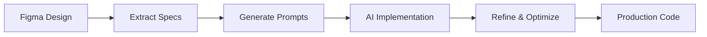

# 🎨 FIGMA PROMPTING GUIDE FOR ELITE FRONTEND DEVELOPMENT
## From Design to Production-Ready Code

---

## 📋 TABLE OF CONTENTS

1. [Introduction to Design-First Development](#introduction-to-design-first-development)
2. [Figma Fundamentals for Developers](#figma-fundamentals-for-developers)
3. [Extracting Design Specifications](#extracting-design-specifications)
4. [Component-Based Prompting](#component-based-prompting)
5. [Design System Translation](#design-system-translation)
6. [Responsive Design Prompts](#responsive-design-prompts)
7. [Animation & Interaction Prompts](#animation--interaction-prompts)
8. [Accessibility Considerations](#accessibility-considerations)
9. [Performance-Optimized Implementation](#performance-optimized-implementation)
10. [Elite Prompt Templates](#elite-prompt-templates)

---

## 🚀 INTRODUCTION TO DESIGN-FIRST DEVELOPMENT

### The Elite Workflow



### Key Principles

1. **Pixel-Perfect Accuracy**: Every design detail matters
2. **Component Thinking**: Break designs into reusable pieces
3. **System-First Approach**: Build consistent design systems
4. **Performance by Default**: Optimize from the start
5. **Accessibility Always**: WCAG compliance built-in

---

## 🎯 FIGMA FUNDAMENTALS FOR DEVELOPERS

### Essential Figma Concepts

#### 1. Auto Layout
```
Auto Layout = CSS Flexbox/Grid
- Direction: row/column = flex-direction
- Spacing: gap between = gap
- Padding: inner spacing = padding
- Alignment: distribute = justify-content/align-items
```

#### 2. Components & Variants
```
Figma Component = React Component
- Main Component = Component Definition
- Instance = Component Usage
- Variants = Component Props/States
- Properties = Component Props
```

#### 3. Design Tokens
```
Figma Variables = CSS Custom Properties
- Colors = --color-primary
- Spacing = --spacing-unit
- Typography = --font-size-base
- Effects = --shadow-elevation
```

### Figma Developer Mode Features

```typescript
// What to extract from Developer Mode:
interface FigmaExtraction {
  // CSS Properties
  styles: {
    width: string;
    height: string;
    padding: string;
    margin: string;
    borderRadius: string;
    background: string;
    boxShadow: string;
  };
  
  // Layout Information
  layout: {
    display: 'flex' | 'grid';
    flexDirection?: 'row' | 'column';
    justifyContent?: string;
    alignItems?: string;
    gap?: string;
  };
  
  // Typography
  typography: {
    fontFamily: string;
    fontSize: string;
    fontWeight: string;
    lineHeight: string;
    letterSpacing: string;
    textAlign: string;
  };
  
  // Assets
  assets: {
    images: string[];
    icons: string[];
    svgs: string[];
  };
}
```

---

## 📐 EXTRACTING DESIGN SPECIFICATIONS

### Systematic Extraction Process

#### 1. Component Hierarchy
```
PROMPT TEMPLATE:
"I have a Figma design with the following component hierarchy:
- Container: [width]x[height], padding: [values]
  - Header: flex row, gap: [value], justify: space-between
    - Logo: [dimensions]
    - Navigation: flex row, gap: [value]
    - User Menu: [specifications]
  - Main Content: [layout details]
  - Footer: [specifications]

Generate a React component structure that matches this hierarchy."
```

#### 2. Color System Extraction
```
PROMPT TEMPLATE:
"Extract and implement this color system from Figma:
Primary Colors:
- primary-50: #E3F2FD
- primary-100: #BBDEFB
- primary-500: #2196F3 (main)
- primary-900: #0D47A1

Neutral Colors:
- gray-50 through gray-900

Semantic Colors:
- success: #4CAF50
- error: #F44336
- warning: #FF9800
- info: #2196F3

Create CSS custom properties and a TypeScript theme object."
```

#### 3. Typography Scale
```
PROMPT TEMPLATE:
"Implement this typography system from Figma:
Font Family: Inter, system-ui, sans-serif

Scale:
- xs: 12px/18px, weight: 400
- sm: 14px/20px, weight: 400
- base: 16px/24px, weight: 400
- lg: 18px/28px, weight: 400
- xl: 20px/28px, weight: 500
- 2xl: 24px/32px, weight: 600
- 3xl: 30px/36px, weight: 700

Create typography utilities and components."
```

#### 4. Spacing System
```
PROMPT TEMPLATE:
"Convert this Figma spacing system to code:
Base unit: 4px
Scale: 0, 1, 2, 4, 6, 8, 10, 12, 16, 20, 24, 32, 40, 48, 56, 64

Usage:
- Component padding: 16px (spacing-4)
- Section spacing: 64px (spacing-16)
- Card gap: 24px (spacing-6)

Generate Tailwind config and CSS utilities."
```

---

## 🧩 COMPONENT-BASED PROMPTING

### Elite Component Prompts

#### 1. Card Component
```
ELITE PROMPT:
"Create a card component based on this Figma design:

Visual Specs:
- Dimensions: 320px width, auto height
- Border radius: 16px
- Background: white
- Shadow: 0px 4px 24px rgba(0, 0, 0, 0.08)
- Padding: 24px
- Hover: transform scale(1.02), shadow increase

Content Structure:
- Image: aspect-ratio 16:9, border-radius 12px
- Title: font-size 20px, weight 600, margin-top 16px
- Description: font-size 14px, color gray-600, margin-top 8px
- CTA Button: margin-top 16px, full width

States:
- Default, Hover, Active, Loading, Disabled

Make it fully responsive and accessible with TypeScript types."
```

#### 2. Navigation Component
```
ELITE PROMPT:
"Build a navigation component from this Figma design:

Layout:
- Container: full width, height 64px, sticky top
- Background: white with backdrop-blur
- Border: 1px solid rgba(0,0,0,0.08)
- Padding: 0 24px

Structure:
- Logo: 120px width, left aligned
- Nav Items: centered, gap 32px
- User Menu: right aligned with avatar

Responsive:
- Desktop: horizontal layout
- Tablet: hamburger menu at 768px
- Mobile: full screen overlay menu

Include animations, keyboard navigation, and ARIA labels."
```

#### 3. Form Components
```
ELITE PROMPT:
"Create a form system based on Figma components:

Input Field:
- Height: 48px
- Border: 1px solid gray-300
- Border radius: 8px
- Padding: 12px 16px
- Focus: border-color primary-500, shadow ring

States:
- Default, Hover, Focus, Error, Disabled, Success

Variants:
- Text input
- Password with toggle
- Select dropdown
- Textarea (auto-resize)
- Checkbox and Radio

Include:
- Label positioning
- Helper text
- Error messages
- Required indicators
- Form validation with react-hook-form"
```

---

## 🎨 DESIGN SYSTEM TRANSLATION

### Converting Figma Systems to Code

#### 1. Token System
```
ELITE PROMPT:
"Convert this Figma token system to code:

Color Tokens:
$color-primary: #0066CC
$color-primary-hover: #0052A3
$color-surface: #FFFFFF
$color-surface-raised: #F7F9FB

Spacing Tokens:
$space-xs: 4px
$space-sm: 8px
$space-md: 16px
$space-lg: 24px
$space-xl: 32px

Create:
1. CSS custom properties
2. TypeScript constants
3. Tailwind config extension
4. Styled-components theme"
```

#### 2. Component Library Setup
```
ELITE PROMPT:
"Set up a component library from Figma design system:

Structure:
/components
  /atoms
    - Button
    - Input
    - Icon
    - Typography
  /molecules  
    - Card
    - FormField
    - Navigation
  /organisms
    - Header
    - Hero
    - Footer
  /templates
    - PageLayout
    - DashboardLayout

Include:
- Storybook stories
- Unit tests
- Documentation
- Theme provider
- Export strategy"
```

---

## 📱 RESPONSIVE DESIGN PROMPTS

### Breakpoint Implementation

```
ELITE PROMPT:
"Implement responsive design from Figma frames:

Breakpoints:
- Mobile: 320px - 767px
- Tablet: 768px - 1023px  
- Desktop: 1024px - 1439px
- Wide: 1440px+

Grid System:
- Mobile: 4 columns, 16px margin
- Tablet: 8 columns, 24px margin
- Desktop: 12 columns, 32px margin
- Wide: 12 columns, max-width 1440px, auto margins

Component Behavior:
- Navigation: Hamburger < 768px
- Cards: 1 col mobile, 2 col tablet, 3 col desktop
- Sidebar: Hidden mobile, overlay tablet, fixed desktop

Generate responsive utilities and components."
```

### Fluid Typography

```
ELITE PROMPT:
"Create fluid typography from Figma:

Scale:
- Mobile h1: 24px
- Desktop h1: 48px
- Mobile body: 14px  
- Desktop body: 16px

Implement using:
1. CSS clamp()
2. Fluid type scale
3. Container queries
4. Responsive type components"
```

---

## 🎭 ANIMATION & INTERACTION PROMPTS

### Micro-Interactions

```
ELITE PROMPT:
"Add micro-interactions from Figma prototype:

Button Interactions:
- Hover: scale(1.05), shadow increase
- Active: scale(0.95)
- Transition: all 200ms cubic-bezier(0.4, 0, 0.2, 1)

Card Hover Effects:
- Image: scale(1.1) with overflow hidden
- Shadow: elevate from 4px to 16px
- Content: translateY(-4px)

Loading States:
- Skeleton screens matching component shapes
- Shimmer effect animation
- Progressive content reveal

Page Transitions:
- Fade in: opacity 0 to 1, translateY 20px to 0
- Stagger children with 50ms delay
- Exit animations for route changes

Use Framer Motion for complex animations."
```

### Gesture Support

```
ELITE PROMPT:
"Implement gesture interactions:

Swipe Actions:
- Card carousel with touch/swipe
- Pull to refresh pattern
- Swipe to delete with confirmation

Drag and Drop:
- Reorderable lists
- File upload zones
- Kanban board cards

Touch Optimizations:
- 44px minimum touch targets
- Touch feedback states
- Prevent accidental touches
- Gesture hints for users"
```

---

## ♿ ACCESSIBILITY CONSIDERATIONS

### WCAG Compliance Prompts

```
ELITE PROMPT:
"Ensure accessibility for Figma components:

Color Contrast:
- Check all text meets WCAG AA (4.5:1)
- Interactive elements 3:1 ratio
- Error states visible without color

Keyboard Navigation:
- Tab order matches visual hierarchy
- Focus indicators visible (2px minimum)
- Skip links for navigation
- Trap focus in modals

Screen Readers:
- Semantic HTML structure
- ARIA labels for icons
- Live regions for updates
- Alternative text for images

Interactive Elements:
- Buttons vs links usage
- Form labels and errors
- Loading state announcements
- Success/error feedback

Generate accessible component with full ARIA support."
```

---

## 🚄 PERFORMANCE-OPTIMIZED IMPLEMENTATION

### Performance-First Prompts

```
ELITE PROMPT:
"Optimize Figma implementation for performance:

Image Optimization:
- Convert to WebP with fallbacks
- Implement responsive images
- Lazy loading with intersection observer
- Blur-up placeholders

CSS Optimization:
- Critical CSS extraction
- Purge unused styles
- CSS modules for scoping
- Variable fonts for typography

Component Optimization:
- Code splitting by route
- Dynamic imports for heavy components
- Memoization for expensive renders
- Virtual scrolling for long lists

Bundle Optimization:
- Tree shaking setup
- Vendor chunk splitting
- Compression (gzip/brotli)
- Preload critical resources

Target metrics:
- LCP < 2.5s
- FID < 100ms
- CLS < 0.1"
```

---

## 📝 ELITE PROMPT TEMPLATES

### 1. Complete Page Implementation

```
MASTER PROMPT:
"Implement this complete Figma page design:

Page: [Page Name]
Figma URL: [Link]

Sections:
1. Hero Section
   - Full width, 100vh height
   - Background gradient with image overlay
   - Centered content with CTA buttons
   - Scroll indicator animation

2. Features Grid
   - 3 columns desktop, 1 mobile
   - Icon, title, description per card
   - Hover effects and animations
   - Accessible focus states

3. Testimonials Carousel
   - Auto-play with pause on hover
   - Touch/swipe support
   - Indicator dots
   - Smooth transitions

4. CTA Section
   - Gradient background
   - Form integration
   - Success/error states
   - Loading indicators

Technical Requirements:
- React with TypeScript
- Styled-components for styling
- Framer Motion for animations
- React Hook Form for forms
- Fully responsive
- WCAG AA compliant
- Performance optimized
- SEO friendly

Deliver production-ready code with:
- Component files
- Styles
- Types
- Tests
- Documentation"
```

### 2. Design System Component

```
SYSTEM COMPONENT PROMPT:
"Create design system component from Figma:

Component: [Component Name]
Figma Component URL: [Link]

Variants:
- Size: small, medium, large
- Type: primary, secondary, ghost, danger
- State: default, hover, active, disabled, loading

Props Interface:
- children: ReactNode
- variant: ComponentVariant
- size: ComponentSize
- disabled?: boolean
- loading?: boolean
- onClick?: () => void
- className?: string
- [additional props based on component]

Requirements:
- Compound component pattern where applicable
- Polymorphic component support
- ForwardRef for DOM access
- Theme integration
- CSS-in-JS with proper typing
- Storybook stories for all variants
- Unit tests with RTL
- A11y tests
- Performance optimization
- Documentation with examples

Export strategy:
- Named exports
- Type definitions
- Theme extensions
- Utility functions"
```

### 3. Complex Interaction Implementation

```
INTERACTION PROMPT:
"Implement complex interaction from Figma prototype:

Interaction: [Description]
Prototype Link: [Figma Prototype URL]

Behavior:
1. Initial State: [Description]
2. Trigger: [hover/click/scroll/time]
3. Animation: [Description with timing]
4. End State: [Description]

Technical Approach:
- Use Framer Motion for animations
- Implement with React hooks
- Add proper loading states
- Handle edge cases
- Optimize for performance
- Ensure accessibility
- Add haptic feedback (mobile)
- Test across devices

Deliverables:
- Component implementation
- Animation utilities
- Performance metrics
- Usage documentation
- Interactive demo"
```

### 4. Responsive Layout System

```
LAYOUT SYSTEM PROMPT:
"Build responsive layout system from Figma:

Desktop Grid: 12 columns, 32px gutter
Tablet Grid: 8 columns, 24px gutter  
Mobile Grid: 4 columns, 16px gutter

Container Widths:
- Mobile: 100% - 32px
- Tablet: 100% - 48px
- Desktop: 1200px max
- Wide: 1440px max

Common Patterns:
- Sidebar layouts
- Card grids
- Split layouts
- Full-bleed sections

Create:
1. Grid component system
2. Layout components
3. Responsive utilities
4. Container queries setup
5. Debug tools
6. Documentation site
7. Migration guide"
```

---

## 🎯 BEST PRACTICES CHECKLIST

### Before Starting
- [ ] Export all assets from Figma in correct formats
- [ ] Document all design tokens
- [ ] List all component variants
- [ ] Note all interactions and animations
- [ ] Check responsive behaviors
- [ ] Verify accessibility requirements

### During Implementation
- [ ] Match Figma spacing exactly
- [ ] Use consistent naming conventions
- [ ] Implement all component states
- [ ] Add proper TypeScript types
- [ ] Include loading and error states
- [ ] Test on all breakpoints

### After Implementation
- [ ] Visual regression testing
- [ ] Performance audit
- [ ] Accessibility audit
- [ ] Cross-browser testing
- [ ] Documentation complete
- [ ] Design review with designer

---

## 💡 PRO TIPS

1. **Use Figma Plugins**
   - Figma to Code
   - Design Tokens
   - Figma to React

2. **Maintain Design Fidelity**
   - Use browser DevTools to match pixels
   - Take screenshots for comparison
   - Use visual regression tools

3. **Collaborate with Designers**
   - Regular sync meetings
   - Shared terminology
   - Component naming alignment

4. **Version Control**
   - Tag Figma versions
   - Match code versions
   - Document changes

5. **Performance First**
   - Optimize images during implementation
   - Lazy load non-critical components
   - Minimize bundle size

---

This guide enables you to transform any Figma design into production-ready, enterprise-grade frontend code. Use these prompts to maintain design fidelity while ensuring performance, accessibility, and maintainability.
